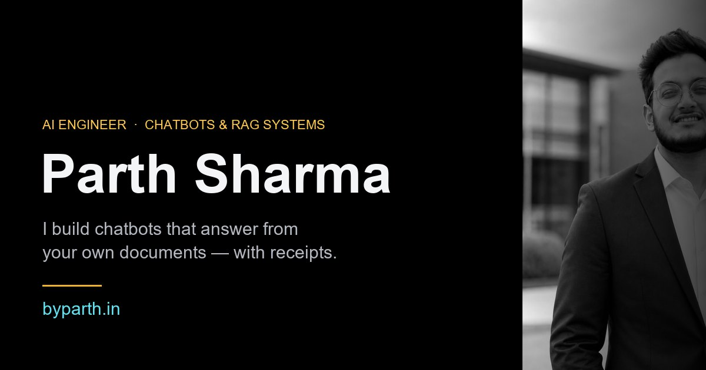

<p align="center">
  
</p>

<h1 align="center">byparth.in</h1>

<p align="center">
  My portfolio — and, more to the point, three working demonstrations of the
  thing I actually do.<br>
  <a href="https://byparth.in"><strong>byparth.in</strong></a>
</p>

<p align="center">
  
  
  
  
  <br>
  
  
  
</p>

---

## Why this exists

Most portfolios describe the work. This one lets you use it.

I build chatbots and retrieval systems over a company's own documents — the
kind of problem where a confident wrong answer is worse than no answer. That
is hard to prove in a paragraph, so the site proves it three times instead,
and every one of those demonstrations runs in the visitor's own browser.

There is no backend here. No API keys, no server, no analytics, no network
call of any kind after the page loads. That is not only a hosting decision —
it is the same argument I make to clients about where their documents should
live, so the site had better make it honestly.

## The three demonstrations

**1 · Ask this page anything**
A working search assistant whose entire document set is the page you are
reading. BM25 ranking (k1=1.5, b=0.75) over passages built from the site's own
content object, with a stopword list, per-sentence selection, term
highlighting and numbered citations. It answers with sources, refuses honestly
when nothing matches, and greets you instead of refusing when you just type
"hi" — that last case is the one most search boxes get wrong.

**2 · See your document the way an AI does**
Drop in a `.txt` or `.md` file and watch it get cut into passages live. It
splits on structure first — markdown headings, numbered clauses like `4.2`,
ALL-CAPS lines, `Annex`/`Appendix` — then by size within each section,
recursively. Tables are detected and emitted whole rather than sliced in half,
overlap starts at a word boundary, and fragments under 60 tokens are merged
into their neighbour instead of being indexed as noise. Two sliders re-chunk
everything as you drag them.

Your file never leaves the browser. `FileReader` only — there is deliberately
no `fetch()` anywhere in that file, and the network tab will show you that.

**3 · How a document chatbot actually works**
A five-step scroll-driven explainer — files, chunking, embeddings, retrieval,
the cited answer — where one diagram rebuilds itself as you scroll rather than
five diagrams sliding past.

## How it is built

Plain HTML, CSS and vanilla JavaScript. No React, no framework, no bundler, no
npm, no build step. What is in this repository is exactly what the browser
receives.

```
index.html         structure and section anchors
styles.css         design tokens, layout, the whole scroll-driven film
main.js            CONTENT — every word on the page — plus the renderers
sandbox-ask.js     BM25 retrieval over CONTENT
sandbox-xray.js    structure-aware chunking, FileReader only
404.html
```

**Every word on the page lives in one `CONTENT` object.** The renderers read
from it, and the search index is built from it too — so a fact only ever has
to be changed in one place, and the on-page search updates with it.

**The motion is native.** Each section is a tall scroll track holding a pinned
stage; a single `requestAnimationFrame` loop writes scroll progress (0→1) into
a `--p` custom property and the CSS reads it from there. Reveals use
`animation-timeline: view()` where it is supported, with a static fallback
where it is not, and everything switches off under
`prefers-reduced-motion: reduce`.

**Accessibility was not a pass at the end.** Skip link, one `h1`, labelled
fields, visible `:focus-visible` on every control, 44px touch targets, and
contrast checked against the palette rather than eyeballed — the lowest pair
on the page is 5.3:1.

## Running it

Nothing to install.

```bash
git clone https://github.com/beyuneek/byParth.git
cd byParth
python -m http.server 5173
```

Then open `http://localhost:5173`.

## Deployment

Cloudflare Pages, building from `main`. No build command and no output
directory — the repository is served as it is. A push reaches the live site in
about thirty seconds.

## Credits

Type is [Bricolage Grotesque](https://fonts.google.com/specimen/Bricolage+Grotesque),
[Manrope](https://fonts.google.com/specimen/Manrope) and
[IBM Plex Mono](https://fonts.google.com/specimen/IBM+Plex+Mono).
Everything else is mine.

## Contact

**Parth Sharma** — AI Engineer, chatbots and RAG systems · Panchkula, India

[hello@byparth.in](mailto:hello@byparth.in) ·
[LinkedIn](https://www.linkedin.com/in/parth-sharma-5b97a21b8) ·
[byparth.in](https://byparth.in)
